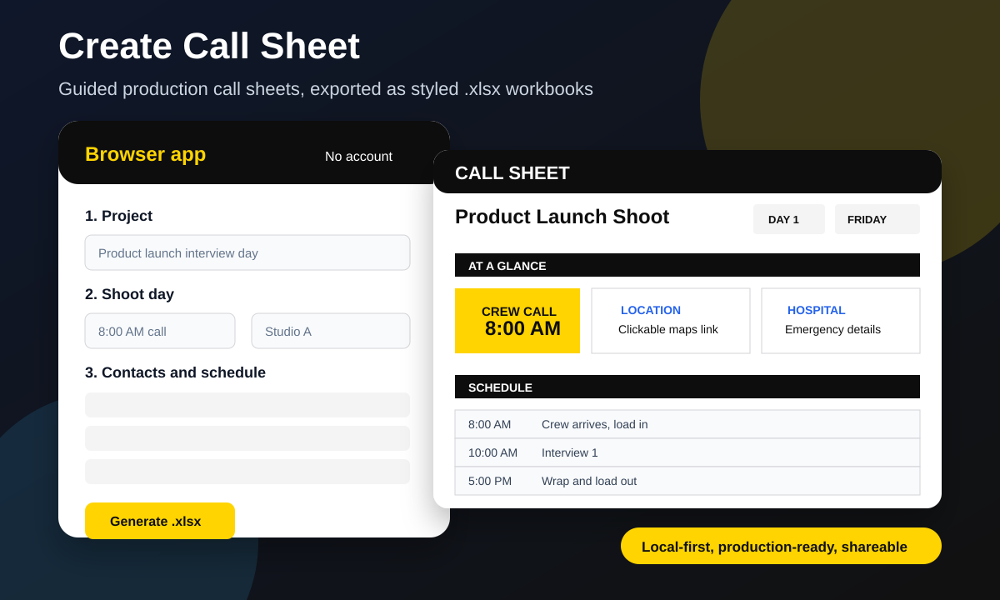

<p align="center">
  <picture>
    <source media="(prefers-color-scheme: dark)" srcset="web/assets/logo-dark.svg" />
    
  </picture>
</p>

<p align="center">
  <a href="https://github.com/evillollive/create-call-sheet/actions/workflows/ci.yml"></a>
  <a href="https://github.com/evillollive/create-call-sheet/actions/workflows/release.yml"></a>
  <a href="LICENSE"></a>
  <a href="https://evillollive.github.io/create-call-sheet/"></a>
</p>

# create-call-sheet

Build a polished production call sheet in minutes: use the Copilot agent skill for an interview-style workflow, or open the no-AI browser app to generate the same styled `.xlsx` entirely on your device.



## Why producers use it

Call sheets get rebuilt from the same ingredients every shoot: project details, locations, parking, crew, schedule, meals, wardrobe, notes, invoicing, and emergency info. `create-call-sheet` turns that repeat work into a guided flow and exports a clean workbook with one tab per shoot day plus a "How to use" tab.

Use it when you need to:

- Draft a call sheet for a video shoot, photo shoot, commercial, documentary, interview day, or small production.
- Reuse recurring crew, client contacts, boilerplate notes, and preferences.
- Import contacts from a previous call sheet instead of retyping.
- Generate a shareable `.xlsx`, with optional `.pdf` export through LibreOffice.

## Install in 60 seconds

### Option 1: Use the browser app

Open the hosted app:

```text
https://evillollive.github.io/create-call-sheet/
```

Or run it locally:

```bash
cd web
python3 -m http.server 8000
# open http://localhost:8000
```

Click **Load sample**, edit the form, then click **Generate .xlsx**.

### Option 2: Use the Copilot skill scripts

```bash
git clone https://github.com/evillollive/create-call-sheet.git
cd create-call-sheet
python3 -m pip install -r requirements.txt
python3 create-call-sheet/scripts/build_callsheet.py \
  create-call-sheet/examples/sample_answers.json \
  /tmp/sample-call-sheet.xlsx
```

To use it as an agent skill, point Copilot at [`create-call-sheet/SKILL.md`](create-call-sheet/SKILL.md). The skill walks through each section, builds the answers JSON, and calls the renderer for you.

## Try it

Generate the included sample workbook:

```bash
python3 create-call-sheet/scripts/build_callsheet.py \
  create-call-sheet/examples/sample_answers.json \
  /tmp/CALLSHEET_sample.xlsx
```

Check daylight for a shoot city:

```bash
python3 create-call-sheet/scripts/sunrise_sunset.py "London" 2026-02-06
```

Autocomplete an address with OpenStreetMap data:

```bash
python3 create-call-sheet/scripts/address_lookup.py "hospital near 235 Euston Rd London"
```

Import crew candidates from an older call sheet:

```bash
python3 create-call-sheet/scripts/import_contacts.py path/to/previous-callsheet.xlsx
```

Export a generated workbook to PDF, if LibreOffice is installed:

```bash
python3 create-call-sheet/scripts/export_pdf.py /tmp/CALLSHEET_sample.xlsx
```

## How it works

The repository has two front doors that produce the same kind of workbook:

| Workflow | Best for | What happens |
|---|---|---|
| Copilot agent skill | Producers who want an interview-style assistant | The agent reads local profile defaults, asks for one section at a time, validates critical fields, then calls the Python workbook builder. |
| Browser app | Anyone who wants a no-AI, no-account form | The static app in `web/` renders a guided form and uses a browser port of the workbook builder with vendored ExcelJS. |
| Manual scripts | Automation, testing, or custom pipelines | You pass a JSON answers object into `build_callsheet.py` and get a styled `.xlsx`. |

Core scripts:

| Script | Purpose |
|---|---|
| `build_callsheet.py` | Renders the `.xlsx` workbook from a JSON answers object. |
| `profile.py` | Manages a local profile with crew roster, clients, standard notes, and preferences. |
| `sunrise_sunset.py` | Looks up sunrise and sunset using `astral`. |
| `import_contacts.py` | Extracts crew candidates from old `.xlsx` or `.pdf` call sheets. |
| `address_lookup.py` | Uses Photon/OpenStreetMap for optional address autocomplete. |
| `export_pdf.py` | Converts `.xlsx` to `.pdf` through LibreOffice. |

## What is in the box

- Multi-day call sheets with one workbook tab per shoot day.
- At-a-glance cards for crew call, location, nearest hospital, first shot, wrap, lunch, sunrise, sunset, and weather.
- Google Maps links for location and hospital cells.
- Department contacts for production, camera, G&E, sound, art, vanities, support, client, agency, talent/interviewees, and vendors.
- Schedule rows, on-site emergency contacts, parking, building access, wardrobe, meals, notes, invoicing, and production report blocks.
- Role normalization for common production abbreviations such as DP, PA, HMU, AC, EP, and G&E.
- Local profile support so recurring crew and notes can be reused.
- Static browser app with no backend, no build step, and a strict Content Security Policy.

## Privacy and trust

- The browser app runs locally in the browser and stores profile data only in `localStorage`.
- No account, backend, analytics, or API key is required.
- Address autocomplete calls Photon/OpenStreetMap only when you ask it to.
- Sunrise and sunset lookup in the browser uses Open-Meteo only when you ask it to.
- The Python daylight lookup uses the local `astral` library.
- PDF export is optional and depends on local LibreOffice.

## Repository layout

```text
create-call-sheet/
|-- create-call-sheet/
|   |-- SKILL.md          # Agent skill instructions
|   |-- README.md         # Skill-level technical notes
|   |-- examples/         # Sample answers JSON plus sample output workbook
|   `-- scripts/          # Python builder, profile, lookup, import, and PDF scripts
|-- docs/
|   |-- SHARING.md        # Launch checklist and sharing copy
|   `-- assets/           # Lightweight preview assets
|-- tests/                # Python unit tests
|-- web/                  # Static no-AI browser app
|-- requirements.txt      # Python dependencies
`-- README.md             # GitHub landing page
```

## Validation

Install dependencies and run the test suite:

```bash
python3 -m pip install -r requirements.txt
python3 -m pip install pytest
python3 -m pytest tests/ -v
```

CI runs the same tests on Python 3.10 and 3.12. The release workflow creates semantic-version tags, publishes GitHub Releases, stamps `web/version.js`, and deploys `web/` to GitHub Pages on pushes to `main`.

## Search phrases

If you are trying to find this again, search for:

- call sheet generator
- production call sheet template
- film call sheet spreadsheet
- video shoot call sheet
- AI call sheet assistant
- no-code call sheet maker
- browser call sheet xlsx
- Copilot skill for producers

## Share it

If this saves you a spreadsheet rebuild, share the hosted browser app or the repo:

```text
Build a production call sheet in minutes. No account, no backend, exports a polished .xlsx:
https://github.com/evillollive/create-call-sheet
```

See [`docs/SHARING.md`](docs/SHARING.md) for launch copy, demo script, suggested repo topics, and follow-up ideas.

## License

See [LICENSE](LICENSE).
